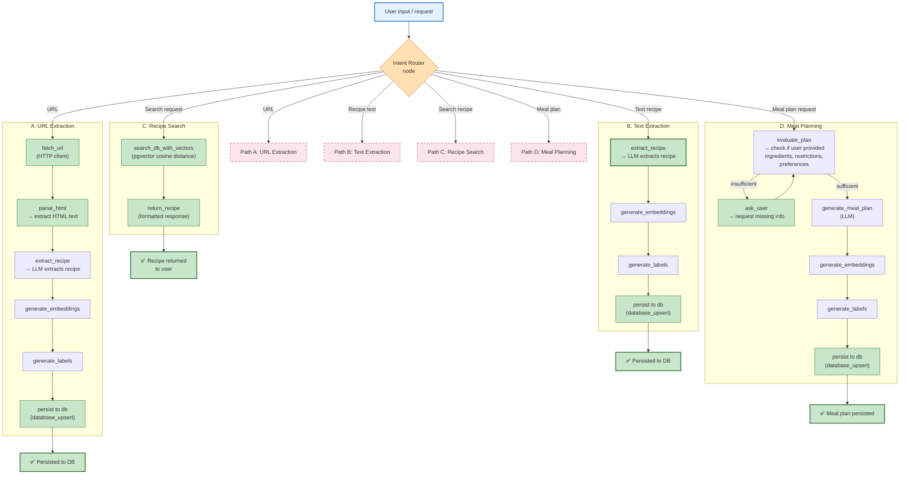
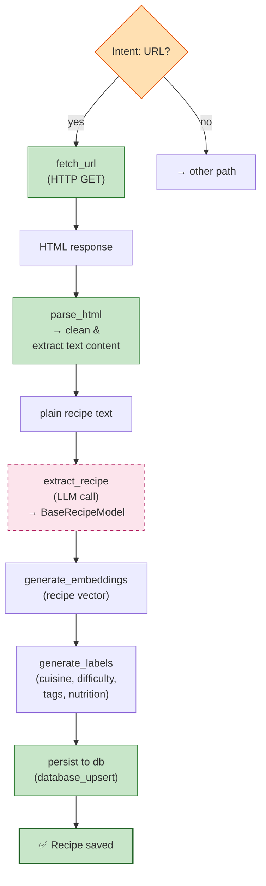
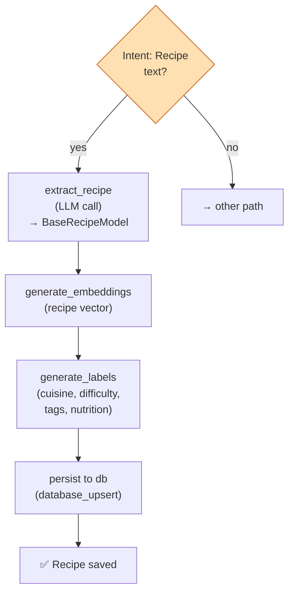
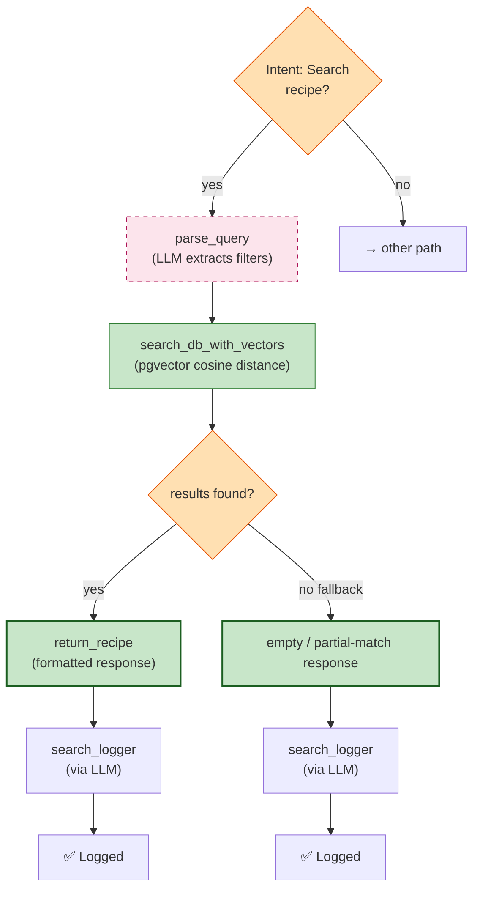
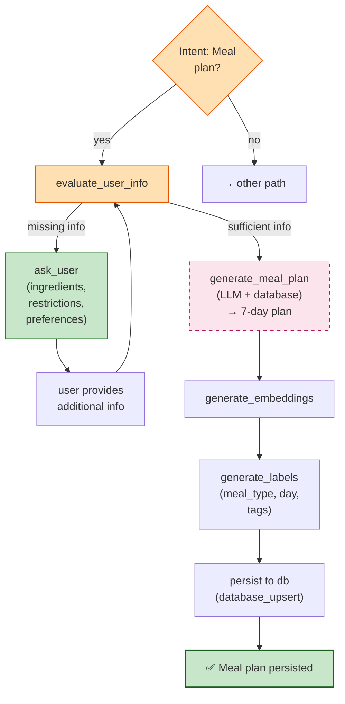

# Recipe Agent LangGraph Diagrams

## Database Pre-Setup

Before running migrations or starting the API, ensure PostgreSQL and pgvector are ready.

### Requirements

- PostgreSQL 16+ (or a Postgres image with pgvector installed, such as `pgvector/pgvector:pg16`)
- A database matching `DATABASE_URL` in `.env`
- A DB user with permission to create extensions (or have an admin pre-create the extension)

### One-time database setup

1. Create the database if it does not exist.
2. Enable pgvector in that database:

```sql
CREATE EXTENSION IF NOT EXISTS vector;
```

If your DB user cannot create extensions, ask an admin to run that statement once.

### Generate and apply migrations

Use the project CLI wrappers:

```bash
uv run python -m remy migrate revision --message "Initial schema" --autogenerate
uv run python -m remy migrate upgrade head
```

### Startup behavior

The startup script runs migrations before launching the API. On a fresh setup with no migration files, it bootstraps the recipe table. Once revision files exist, it runs normal Alembic upgrades.

### Docker quickstart (local)

Use this flow for first-time local setup with Docker Compose:

```bash
docker compose up -d postgres
docker compose ps postgres
docker compose up -d app
```

Notes:

- `app` startup waits for Postgres readiness and runs migrations automatically.
- The configured Postgres image (`pgvector/pgvector:pg16`) includes pgvector, and the initial migration creates the `vector` extension.

## Top-Level Architecture

Single entry point with intent-based routing to 4 parallel paths. Each path handles a specific user intent (URL extraction, text extraction, recipe search, or meal planning) and converges to an appropriate final state.

### Unified Graph



---

## Path A — URL Extraction Detail

**Trigger:** User submits a URL to a recipe page.
**Flow:** Fetch HTML → parse text → extract via LLM → generate embeddings & labels → persist.



---

## Path B — Text Extraction Detail

**Trigger:** User pastes recipe text (no URL needed).
**Flow:** Direct LLM extraction → embeddings & labels → persist.



---

## Path C — Recipe Search Detail

**Trigger:** User submits a natural-language search query.
**Flow:** Parse query → vector similarity search → return ranked results.



---

## Path D — Meal Planning Detail (with iterative loop)

**Trigger:** User requests a weekly meal plan.
**Flow:** Evaluate user info → ask if insufficient → generate plan → embeddings & labels → persist.



---

## Summary Table (Updated)

| Path | Trigger | Node Sequence | End State |
|------|---------|---------------|-----------|
| **A** — URL Extraction | User submits a URL | `fetch_url` → `parse_html` → `extract_recipe` → `generate_embeddings` → `generate_labels` → `persist to db` | Persisted to DB |
| **B** — Text Extraction | User pastes recipe text | `extract_recipe` → `generate_embeddings` → `generate_labels` → `persist to db` | Persisted to DB |
| **C** — Recipe Search | User searches for a recipe | `parse_query` → `search_db_with_vectors` → `format_response` / `empty response` | Returned to user |
| **D** — Meal Planning | User requests a meal plan | `evaluate_user_info` → _(loop: ask if insufficient)_ → `generate_meal_plan` → `generate_embeddings` → `generate_labels` → `persist to db` | Persisted to DB |
